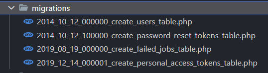
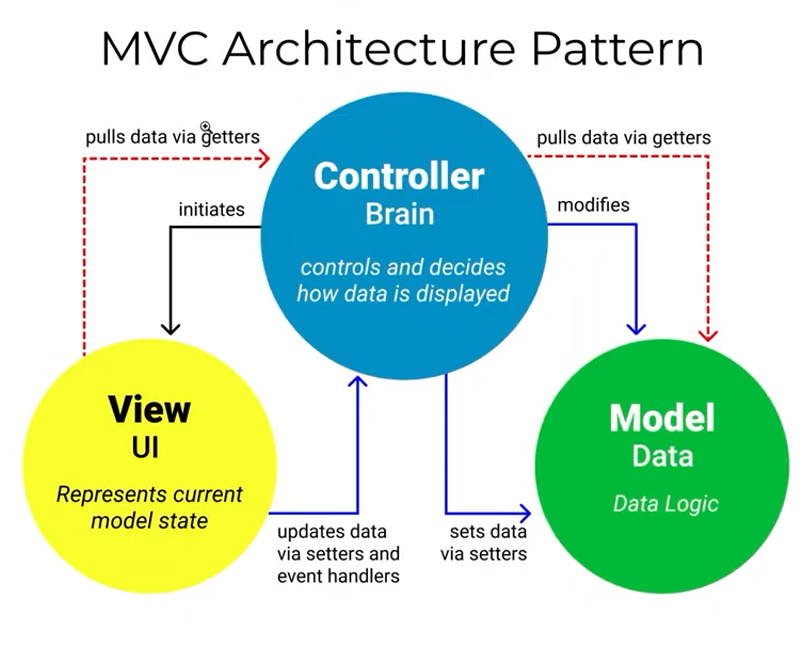

# Learning Laravel

> Started a new journey of learning Laravel during a project requirement for the internship.
> <br>
> Up until now I found it very interesting and easy to go with and it's kind of at your fingertips to create such amazing projects and web Apps.

> ### phpunit.xml
>
> It's a framework for php testing.

> laravel -> project
> laravel framework -> framework

## Require & Require-dev

_These packages are required during the run and development time._

> Just like npm install there is composer install.

## .env file

It's a centrallised secret file for all the secrets of our app.

## breeze

It's a package for authentication in laravel. You can use this after by checking out this [Link](https://laravel.com/docs/10.x/starter-kits#laravel-breeze).

> ### How to connect our application to Database?
>
> it picks the name of db in .env file.
> php artisan migrate -> this command will create the database for you if there is a server running mysql.

## Understanding the Migration

Migrations are like version control for your database, allowing your team to define and share the application's database schema definition. If you have ever had to tell a teammate to manually add a column to their local database schema after pulling in your changes from source control, you've faced the problem that database migrations solve.

> migrate <br>
> migrate:fresh Drop all tables and re-run all migrations<br>
> migrate:install Create the migration repository<br>
> migrate:refresh Reset and re-run all migrations<br>
> migrate:reset Rollback all database migrations<br>
> migrate:rollback Rollback the last database migration<br>
> migrate:status Show the status of each migration

```powershell
Description:
  Run the database migrations

Usage:
  migrate [options]

Options:
      --database[=DATABASE]        The database connection to use
      --force                      Force the operation to run when in production
      --path[=PATH]                The path(s) to the migrations files to be executed (multiple values allowed)
      --realpath                   Indicate any provided migration file paths are pre-resolved absolute paths
      --schema-path[=SCHEMA-PATH]  The path to a schema dump file
      --pretend                    Dump the SQL queries that would be run
      --seed                       Indicates if the seed task should be re-run
      --seeder[=SEEDER]            The class name of the root seeder
      --step                       Force the migrations to be run so they can be rolled back individually
      --isolated[=ISOLATED]        Do not run the command if another instance of the command is already running [default: false]
  -h, --help                       Display help for the given command. When no command is given display help for the list command
  -q, --quiet                      Do not output any message
  -V, --version                    Display this application version
      --ansi|--no-ansi             Force (or disable --no-ansi) ANSI output
  -n, --no-interaction             Do not ask any interactive question
      --env[=ENV]                  The environment the command should run under
  -v|vv|vvv, --verbose             Increase the verbosity of messages: 1 for normal output, 2 for more verbose output and 3 for debug
```

_Checkout database>migrations._


#### _Laravel records all of the tables it has created during migration in a table named "migration" in our database. That means you cannot change anything by changing a migration file laravel has already executed because it is not going to touch that file again._

#### In order to update any existing table you have to use `php artisan make:migration name_of_migration --table=existing_table_name` command.

_It was not running in my case due to some compatibility issue with mariaDB version. But I've found a way to run raw SQL queries for the time being._

#### There is something called **Localization feature in laravel**.

## Using php in Blade template files

you can use `{{____}}` for php code inside the blade template files.

# MVC pattern



## View

> It's the html part which represents the current model state. for example the blade file of mvc pattern.

## Controller

> Controls and decides the data flow.
> Every controller extends the Base Controller of Laravel
> _Make sure that controller is always lean, minimal and very very Short. Should not include any logic of your application_

## Model

> Models help us to interact with the database.
> This is responsible to do all the CRUD mySQL query in a particular table.
> _if any class extends Model class of Laravel then that class becomes a model_

**Laravel provides a convention whatever the name of the model file the plural of that will be the name of the table. But you can explicitly define your table name by following the below code in your Model class inside the model file that you're working with:**

```php
<?php

namespace App\Models;

use Illuminate\Database\Eloquent\Model;

class Book extends Model
{
  protected $table = 'my_books'; //The model will now use my_books table instead of books by default.
}
```

## MVC Pattern

> It states that whenever we need to reed something we are not directly tell that I need something. We tell the controller to get the data it's controllers's responisbility to fetch the data and pass the views back to us.

# Running raw SQL queries

We can run raw sql queries with something called DB facade.

```php
<?php

use Illuminate\Support\Facades\DB;
use Illuminate\Support\Facades\Route;
use App\Http\Controllers\ProfileController;


Route::get('/', function () {
        // fetch all users
    // $users = DB::select("select * from users where email=?", ['abhay.tiwari.er@gmail.com']);
    // dd($users);

    //create an user
    // $user = DB::insert('insert into users (name, email, password) values (?,?,?)', ['Abhay', '20je0018@me.iitism.ac.in', 'password']);
    // dd($user);

    //updating user
    // $user = DB::update("update users set email='abc@bitfumes.com' where id=2");
    // dd($user);

    //deleting user
    // $user = DB::delete("delete from users where id=2");
    // dd($user);
    return view('welcome');
});
```

# Laravel Query Builder

Instead of running raw SQL queries we can use something called the query building inside the DB facade.

```php
$users = DB::table('users')->where('id', 1)->get();
//There are more methods which we can chain in to create query such as
//->update(['field1','value1', 'field2','value2'])
//->delete()

dd($users);
```

_But you can see this doesn't seem to be that gamechanging. Hold on a minute my friend._
**There are other usefull methods to chain.**
`->value('email')`, `->find(1)` -> find uses key by default, `->chunk(100)` etc.

# Laravel Eloquent ORM (Object Relational Model)

You can also use Eloquent ORM to perform query and this is a breeze. You can use the Model of the table to perform eloquent model.

```php
use App\Models\User;
// $user = User::create([
//   'name'=> 'Abhay',
//   'email'=> 'asdhbdh@gmail.com',
//   'password'=> 'password',
// ])

$user = User::where('id', 5)->first(); // In order to update the user you first have to get the user.
// we can also use ->find(5)
$user->update ([
  'email' => 'abc@iitism.ac.in'
]);
```

### The power of Eloquent

It has some amazing features such as seed, factories & policies that we will be learning in a moment.

> From the Model you can control the Table attributes and control the keys and other features such as increment of id and timestamp.

# Hashing Password

Laravel provides you with the global `bcrypt()` function to incrypt your password.
We can use Eloquent model and perform mutation to change our password from simple string to a hashed string.
You can checkout about mutator in Laravel's official Documentation.

> You have to create a protected function with the same name as the field name. And then the set part is the mutation. & the get part is accessor.

Inside the `app/Models/User.php` below function is responsible for hashing the password during saving into the database via User Model. It's a Mutator.

```php
protected function password(): Attribute
    {
        return Attribute::make(
            set: fn ($value) => bcrypt($value)
        );
    }
```

Similar to mutator there is also accessor. Checkout the official Documentation for more information.

# Configurations in Laravel

It always starts with `.env` file. You can find `/config` directory in the root folder & there all the necessary configurations can be found.

> Laravel uses a global function `env(Key, default value)` in the php file to get the values from `.env` file.

_reading from this file again and again is not good for performance of our app. Hence laravel uses Caching to deal with this._

# Caching in Laravel

Go into `/bootstrap/cache` directory inside your root directory.

## Configuration Caching in Laravel

> in the php artisan we have `config` related command.
> if we run the `php artisan config:cache` command there will be a new file inside your `bootstrap/cache`. It is responsible for reading and storing all the necessary details of each and every file inside config for faster performance.

_Whenever you change something in `.env` (Make sure to add quotes if your string consists spaces.). We have to run `php artisan config:cache` again_

> `config:clear` removes the config cache

# Avatar & Tinker

We have a basic login/register facility up untill now which is provided by `breeze`. We want to give user the functionality to add an avatar.

1. At first We have to create a column to store the avatar field in the database.
2. We did that after creating a new migration.
3. Tinker -> A CL Application which is for interacting your application.
4. Tinker can help filling the avatar information for the existing users.
    > php artisan tinker _This will open a command line interface for our laravel app. You can run all sort of php commands in the CLI._

```php
$user = User::find(4);
$user->avatar = 'skdalkdhlk';
$user->save();
```

**There is another method**

```php
$user = User::find(12);
$user->update([
  'avatar' => 'aldaslkdaslj'
]);
```

> But The above method will not reflect the change in Database despite returning true.

### Here comes the yet another laravel functionality mass assignment into the picture.

[Official Mass Assignment](https://laravel.com/docs/10.x/eloquent#mass-assignment)

> Our User model have specified fillable and gaurded fields inside the model.
> _Make sure to restart the tinker and again start after doing any changes in codebase._

**We can use `User::ungaurded()` & `User::regard()` commands to bypass the fillable and gaurded properties.**

### @include('profile.partials.update-profile-information-form') this line will help including the partial files.

We are setting up the Avatar Card for updating the avatar field.

# Method Spoofing

```php
<form method="post" action="{{route('profile.avatar')}}">
  @method('PATCH') //HTMl does not provide patch request. We need to perform method spoofing.
    <div>
      <x-input-label for="name" value="Avatar" />
      <x-text-input id="avatar" name="avatar" type="file" class="mt-1 block w-full" :value="old('avatar', $user->avatar)" required autofocus autocomplete="avatar" />
      <x-input-error class="mt-2" :messages="$errors->get('avatar')" />
    </div>

    <div class="flex items-center gap-4">
      <x-primary-button>{{ __('Save') }}</x-primary-button>
    </div>
</form>
```

> Equivalent way.
> <input type="hidden" name="_method" value="patch">

# CSRF - Cross Site Request Forgeries

In your `app\Http\Middleware\VerifyCsrfToken.php` file you can find the CSRF token verifier.
It helps your site to indentify the real user and make sure that form is not being submitted by any mallicious user.

```php
<form method="post" action="{{route('profile.avatar')}}">
  @method('PATCH') //HTMl does not provide patch request. We need to perform method spoofing.
    <div>
      <x-input-label for="name" value="Avatar" />
      <x-text-input id="avatar" name="avatar" type="file" class="mt-1 block w-full" :value="old('avatar', $user->avatar)" required autofocus autocomplete="avatar" />
      <x-input-error class="mt-2" :messages="$errors->get('avatar')" />
    </div>

    <div class="flex items-center gap-4">
      <x-primary-button>{{ __('Save') }}</x-primary-button>
    </div>
</form>
```

> Equivalent way.
> <input type="hidden" name="_token" value="{{ csrf_token() }}">

# Controller and Redirect Session

One can create controller by using the following command
`php artisan make:controller Profile/AvatarController`.

```php
class AvatarController extends Controller
{
  public function update()
  {
    return response()->redirectTo('/profile');
  }
}
```

**The above code is for redirecting to any route.**
_We can use `return redirect('/profile')` & `->redirectTo(route('route-name'))` also. Instead of that we can also use ->back() method._

### The code below is returning to back with a message of success.

```php
<?php

namespace App\Http\Controllers\Profile;

use App\Http\Controllers\Controller;
use Illuminate\Http\Request;

class AvatarController extends Controller
{
    public function update()
    {
        return back()->with('success', 'Avatar is updated successfully.');
    }
}
```

```html
@if (session('success'))
<div class="text-red-500">{{session('success')}}</div>
@endif
```

Inside our blade file. We access the message through a method described above

_There is also a method `->withInput()` which is used to fill the old values back into the form if there is some error occured and we were redirected back to form._
